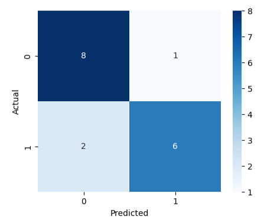

# 🎬 Movie Sentiment Classifier  
A simple end-to-end machine learning project that classifies movie reviews as **Positive** or **Negative** using the **Naïve Bayes** algorithm and **bag-of-words** text features.

This project demonstrates:
- Data loading & preprocessing  
- Text vectorization using CountVectorizer  
- Model training (Multinomial Naive Bayes)  
- Evaluation (accuracy, precision, recall, f1-score)  
- Real-time prediction function  
- Jupyter notebook experimentation  
- Organized production-ready project structure  

---

## 📁 Project Structure

```
movie-sentiment-classifier/
│
├── data/
│   └── reviews.csv                # Dataset (raw text + labels)
│
├── notebook/
│   └── sentiment_model.ipynb      # Full experiments, tests, errors, improvements
│
├── src/
│   ├── preprocess.py              # Data loading and cleaning helpers
│   └── train.py                   # Training script for production
│
└── README.md                      # Project documentation
```

---

## 📊 Dataset

The dataset contains movie reviews labeled as:

- **1 → Positive**
- **0 → Negative**

Example structure:

| review                                     | sentiment |
|-------------------------------------------|-----------|
| The movie was fantastic and emotional!    | 1         |
| Very boring, I almost slept.              | 0         |

---

## 📊 Confusion Matrix

Below is the confusion matrix of the model performance:



----

## ⚙️ Installation

```bash
git clone https://github.com/PratikCoder19/movie-sentiment-classifier.git
cd movie-sentiment-classifier
pip install -r requirements.txt
```

---

## 🚀 Training the Model

```bash
python src/train.py
```

This will:

- Load the dataset  
- Clean & preprocess text  
- Train the Naive Bayes classifier  
- Print accuracy and classification report  

---

## 🔍 Predicting Sentiment

Example function (included in notebook):

```python
def predict_sentiment(text):
    vector = vectorizer.transform([text])
    pred = model.predict(vector)[0]
    return "Positive 😊" if pred == 1 else "Negative 😡"
```

Usage:

```python
predict_sentiment("I absolutely loved the visuals and acting!")
```

---

## 📈 Model Performance

Latest accuracy:

**82.35%**  
(Trained on synthetic + sample movie reviews)

Classification report included in the notebook.

---

## 🧪 Jupyter Notebook

The notebook contains:

- Data exploration  
- Feature analysis  
- Model improvements  
- All errors and debugging (kept intentionally for learning)  
- Final working version  

---

## 🔮 Future Improvements

- Add TF-IDF features  
- Add Logistic Regression / SVM  
- Deploy using Gradio UI  
- Save and load model using joblib  
- Use a larger real dataset (IMDB / Rotten Tomatoes)

---

## 📜 License

This project is for educational use and freely extendable.

---

If you like this project, ⭐ the repo!  
